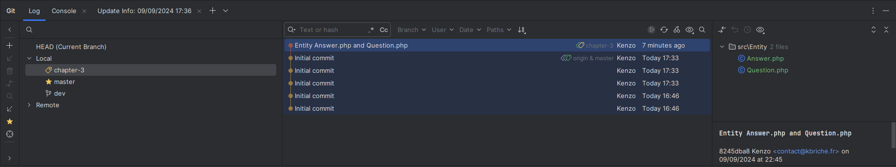

include::./.config/attributes/header_attributes.adoc[]

= compte rendu du jeu 20 su 20
:doctype: book
:toc:
:toc-title: table des matière
:author: Briche Kenzo
:sectnums:
:version-label: v.
:revdate: 09/09/2024
:revnumber: 1
:email: contact@kbriche.fr
:pdf-theme: {theme_path_name}

[[Les_Entitees]]
== Les premières Entitées

include::entities/question.adoc[leveloffset=+2]

include::entities/answers.asciidoc[leveloffset=+2]

[[Les_Premiers_commits_et_branches]]
== Les Premiers commits et branches

voici un le premier commit de la branche "chapter/create-entities", qui est une branche enfant de la branche "dev" :

//debut chapitre MVC 11h34

* Quel rôle ont les valeurs stockées dans la colonne id de la table question ?
-> Elles ont pour rôle d'identifier de manière unique chaque question dans la BDD.

* Le fait de stocker des valeurs de cette colonne dans la colonne question_id de la table
answer fait de la colonne question_id une colonne particulière. Quel rôle ont les valeurs qui sont stockées dans cette colonne ? +
-> Elles ont pour rôle de lier une réponse à une question en fonction de son id.

* Une clé primaire permet d'identifier de manière unique chaque enregistrement d'une BDD
Une clé étrangère permet de lier 2 tables d'une BDD en fonction d'une colonne spécifique (souvent la liaison est faite avec la clé primaire d'une table)

=== Créer une réponse liée à une question :

[source, sql]
----
INSERT INTO answers (content_text, question_id)
VALUES ('Ceci est une réponse test', 999);
----

Q7 b. :

[source, sql]
----
ERROR: insert or update on table "answer" violates foreign key constraint
DETAIL: Key (question_id)=(999) is not present in table "question".
----

Q7 c. :
[source, sql]
----
INSERT INTO answers (content_text, question_id)
VALUES ('Ceci est une réponse valide', 1);
----

Q7 d. :
[source, sql]
----
ERROR: update or delete on table "answer" violates foreign key constraint
DETAIL: Key (question_id)=(999) is not present in table "question".
----

Q7 g. :
[source, sql]
----
DELETE FROM question
WHERE id = 1;
----